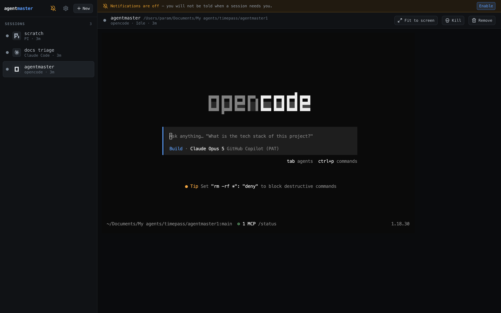
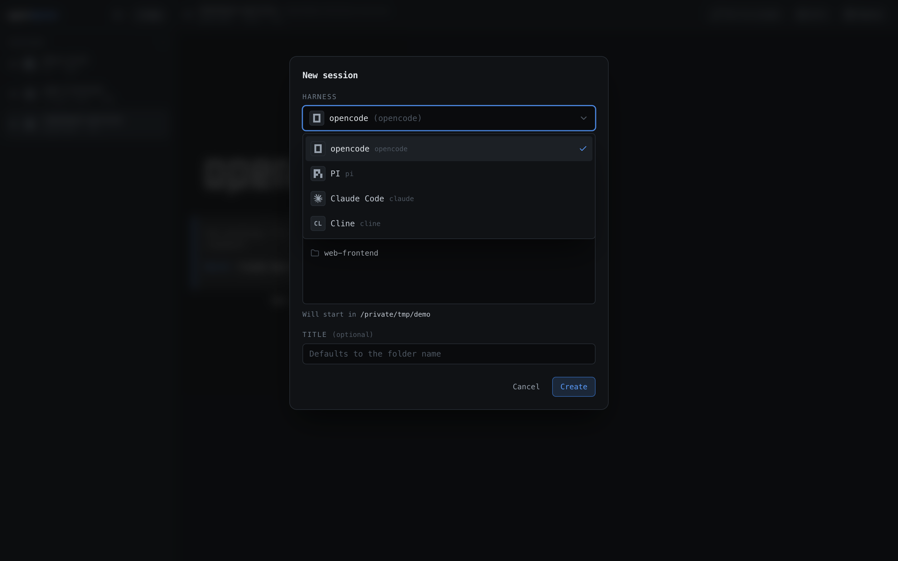
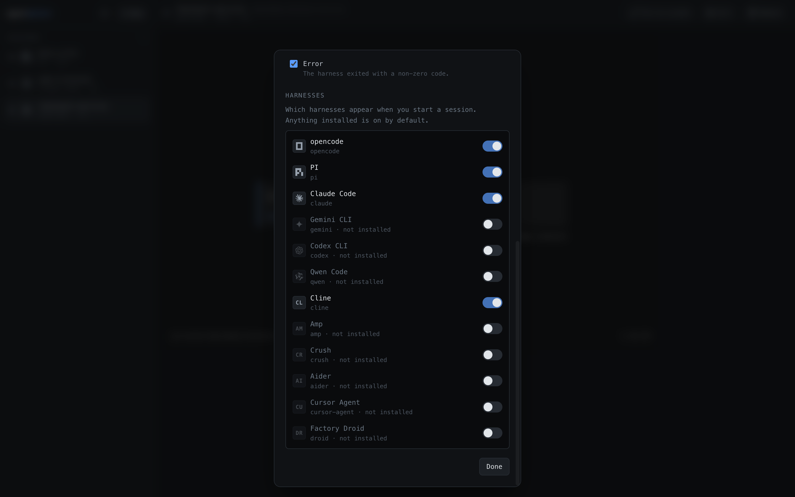
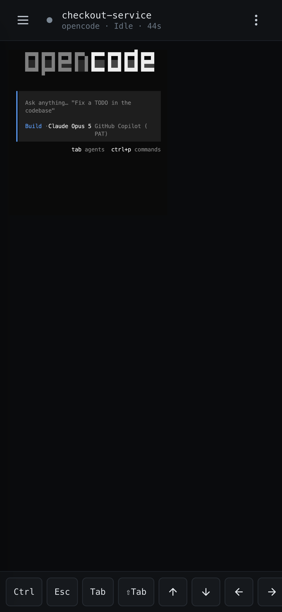
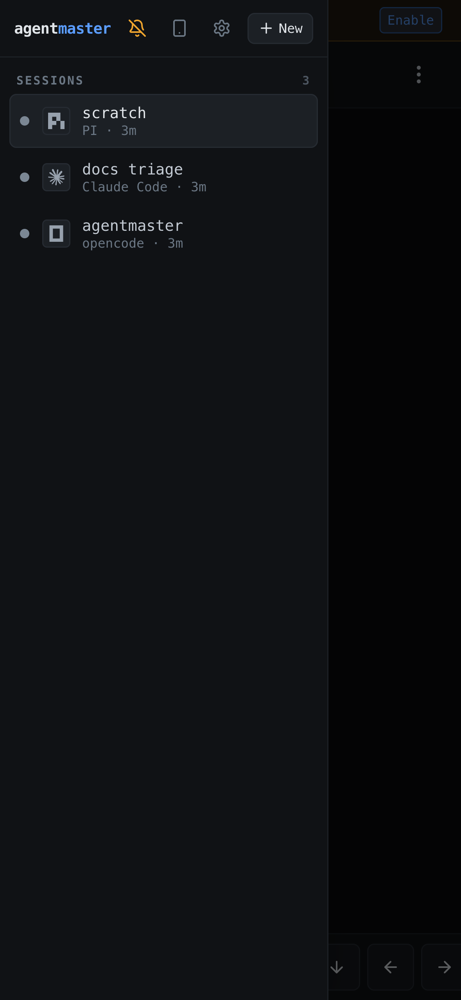

# agentmaster

One dashboard for every AI CLI harness running on your laptop — opencode, Claude
Code, Gemini CLI, Codex, Qwen Code, PI, and anything you add later.

Agent CLIs run in terminals you stop watching. Past two of them you lose track:
a session blocks on a permission prompt and sits there for forty minutes because
nobody was looking at that tab. agentmaster mirrors every session into one
browser window, tells you which ones need you, and notifies you when they do.



## How it works

There is no protocol and no per-harness integration. Each harness is spawned in
a **pseudo-terminal**, so it believes a human is sitting at a real terminal —
`isatty()` is true, it renders its full colour TUI, and Ctrl-C arrives as a real
`SIGINT`. Raw bytes stream to xterm.js in the browser and back, unmodified. That
is why arrow-key menus, `⇧Tab` plan mode, `/model`, and Ctrl-C all work
identically for every harness.

In parallel, the same bytes feed a **headless terminal emulator** on the server.
Status detection regexes run against that *rendered screen*, not the byte
stream — harnesses repeatedly overwrite one line with `\r\x1b[K`, so "Thinking…"
stays in the stream forever while being visually erased. Matching the rendered
grid is the only way to see what you would see.

```
browser (xterm.js) ──ws /term/:id (binary)──┐
                                            ├── PtySession ── PTY ── harness
browser (sidebar)  ──ws /events   (JSON)────┘       │
                                                    ├─ ring buffer (2 MB replay)
                                                    └─ screen model → status engine
```

Everything harness-specific lives in `harnesses.yaml`. Adding a CLI is a config
entry. A CLI with *no* entry still gets a working terminal plus busy/idle/exited
from the generic idle timer.

## Screenshots

Every harness is picked from one list, showing only the ones you have installed:



Which harnesses appear is a setting. Anything found on your `PATH` is on by
default, so the list stays short without any configuration:



The same dashboard on a phone — the full TUI, with a key bar supplying the keys
a soft keyboard has no room for:

| Terminal | Sessions |
| --- | --- |
|  |  |

## Requirements

- Node 22+ (developed on 24)
- Whichever harness CLIs you want to drive, on your `PATH`
- Optional: [tmux](https://github.com/tmux/tmux) (`brew install tmux`) so agents keep running when the server restarts

## Setup

```bash
npm install
npm run dev
```

Open <http://localhost:5273>. The API runs on `127.0.0.1:7180` and Vite proxies
to it.

If `npm install` reports blocked install scripts, approve the native ones —
`node-pty` and `better-sqlite3` need to build:

```bash
npm approve-scripts node-pty better-sqlite3 esbuild
npm rebuild node-pty better-sqlite3
```

> `postinstall` runs `scripts/fix-pty-perms.mjs`, which restores the executable
> bit on node-pty's `spawn-helper`. Without it every spawn fails with an opaque
> `posix_spawnp failed`.

## Using it

- **+ New** — pick a harness and a folder; the session spawns and appears in the sidebar
- **Sidebar** — one dot per session:

| Colour | Status | Meaning |
|---|---|---|
| 🔵 blue (pulsing) | Working | producing output |
| 🟠 amber | Waiting for you | blocked on a menu or permission, **or** it finished its turn — the state that needs action |
| 🟢 green | Done | ran autonomously to completion (e.g. `claude -p`) and you haven't looked yet |
| ⚪ grey | Idle | alive and quiet |
| 🟣 violet | Killed | you pressed Kill |
| ⚫ dim grey | Exited | quit on its own |
| 🔴 red | Error | non-zero exit |

- **Needs attention** — amber sessions, longest-waiting first
- **Quick actions** — when a session is blocked, its harness's answer buttons appear under the terminal. They send keystrokes; a click is indistinguishable from typing.
- **Kill** stops the process but keeps the session listed, so its output stays readable. **Restart** re-runs the same harness in the same folder, reusing the session's slot and clearing the terminal. **Delete** stops the agent and erases the session, its output and its history for good (it will not come back after a restart). **Clear** in the sidebar header deletes every stopped session at once, and **Settings → Background sessions → Delete all sessions** deletes everything.
- **Rename / Pin / Mute** — click the title to rename; pin keeps a session at the top; mute silences its notifications. The sidebar gets a filter box once you have a few sessions.
- **Prompt box** — a normal text box under the terminal. Enter sends, Shift+Enter adds a line; multi-line prompts arrive as one message. The people icon also sends the prompt to other sessions.
- **Find** — `⌘F` searches the terminal scrollback (case and regex toggles). On phones, use the search button.
- **Presets** — in the new-session dialog, set an optional first prompt and tick *Save as preset* to relaunch the same harness + folder + prompt in one click.
- **Screen preview** — the Needs attention list shows the last lines of screen from when each session stopped for you.
- **Timeline** — time working vs. waiting on you, number of stops, longest wait.
- **Changes** — branch and changed-file count in the sidebar, plus a read-only panel of changed files and diffs.
- **Export** — download a session as text, coloured HTML, or an asciinema `.cast` recording.
- **Split view** (desktop) — 1, 2 or 4 panes; input goes to the focused pane.
- **Settings** — phone rules (which events push, quiet hours, muted harnesses), auto-deleting stopped sessions after a set time (off by default), and background sessions.
- **Notifications** — fired when a session needs you, finishes, or crashes. Enable via the gear icon. Killing a session never notifies — you already know. Desktop notifications work while the tab is open in the background; **Web Push** (gear icon → Phone notifications) reaches you with the app closed.
- `⌘N` new session · `⌘K` cycle the attention queue · `⌘F` find · `⌘1–9` jump to a session · `⌘↑/↓` previous/next session (Ctrl+Shift on non-Mac, so readline's Ctrl-K/Ctrl-N still reach the harness)

### Amber vs green

Agent CLIs mostly **end their turn** rather than blocking on a prompt, so
"finished, your move" is the common case — and it is amber, because it needs
you either way. Turn-end detection is deliberately **regex-free**: you submitted
something, it produced output, it went quiet. That works for every harness,
including one with no rules at all.

Amber therefore has two flavours, carried in `waitKind`:

- `permission` / `menu` / `question` — a harness rule matched, so the CLI is
  *modally blocked*. It clears only when the harness moves on. **Looking at it
  does not clear it**; the menu is still on screen and the session is still
  stuck.
- `turn` — generic turn-end, no rule involved (`matchedRule` is unset). It is an
  unread marker, so it clears as soon as you actually look at the session.

Green is now only the autonomous case: a long busy stretch with no submit, such
as `claude -p "do X"` launched from `args`.

**Attached is not the same as looking.** A session left open in a background or
minimised tab does not count as seen — the browser sends an explicit focus
message, and only a *focused* viewer acknowledges anything.

### Sessions across server restarts

With **tmux installed**, each agent runs in its own tmux session on a private
tmux server (`tmux -L agentmaster`, separate from your own tmux). Stopping the
server — including `tsx watch` restarting it on every code change — leaves the
agents running; on the next start they re-attach with their earlier output.
An agent that finished while the server was down shows as stopped with its real
exit code. Use **Kill** or **Delete** to actually end an agent.

Without tmux, agents are stopped when the server stops, as before. Choose
explicitly with `AGENTMASTER_PTY_BACKEND=tmux|direct`.

A stopped session keeps its scrollback so you can read what happened, and
`Restart` brings it back. Stopped sessions are only pruned automatically if you
turn that on in **Settings → Housekeeping**.

## `harnesses.yaml`

```yaml
defaults:
  idle_ms: 2500                  # silence before evaluating status
  finished_after_busy_ms: 20000  # busy longer than this, then idle = "finished"

harnesses:
  - id: claude-code
    name: Claude Code
    command: claude
    args: []
    busy_marker: "esc to interrupt"     # on screen ⇒ still working despite silence
    waiting_input:
      - match: "Do you want to (proceed|make this edit)"
        kind: permission                # permission | question | menu | unknown
        actions:
          - { label: "Yes", keys: "1\r" }
          - { label: "No",  keys: "3\r" }
```

Hot-reloaded on save. A bad regex is logged and the previous config is kept.

Notes:
- Rules are tried in order; first match wins.
- JS `RegExp` has no inline `(?i)`; a leading `(?i)` is stripped and converted to the `i` flag.
- Rendered lines keep leading indentation, so tolerate it: `^\s*❯?\s*\d+\.`
- `keys` are sent verbatim — `"\r"` Enter, `"\u001b"` Esc, `"1\r"` menu choice.

### Creating a folder

The folder picker in **+ New** has a **New** button beside the breadcrumbs that
creates a directory in whichever folder you are currently browsing, then
navigates into it — so the folder you just made is the one the session starts in.

It creates exactly one level, and the name must be a single path segment:
`..`, `a/b` and absolute paths are rejected. Browsing has no path jail (it is
your own machine), but a button labelled "create a folder here" should not be
able to write somewhere else.

### Adding a harness

Add an entry with `id`, `name`, `command`. That alone gives you a terminal,
busy/idle/exited, and generic turn-end detection. Add `waiting_input` rules to
also catch modal prompts (menus, permissions) and get quick-action buttons.

Harnesses we ship carry their official brand mark. Anything else gets a
monochrome two-letter badge automatically. To reuse an existing mark — say for a
fork or a renamed CLI — set `icon`:

```yaml
- id: my-claude-fork
  name: My Claude Fork
  command: myclaude
  icon: claude-code
```

Icons are monochrome on purpose: in the sidebar, colour means *status*, and a
brand palette beside the amber "needs you" dot would dilute the only signal that
asks you to act. Marks are vendored from [simple-icons](https://simple-icons.org)
(CC0-1.0); regenerate with `npm run icons:sync`.

## Verifying detection against a real CLI

`opencode` and `pi` rules are **verified** against fixtures captured from the
real CLIs (opencode 1.18.30, pi 0.85.1) and asserted in
`server/test/detection.test.ts`. Both auto-approve tool calls, so neither has a
permission prompt — their only modal blocked state is a selection widget.

`claude-code`, `gemini-cli`, `codex` and `qwen-code` are **unverified**
reconstructions that pass synthetic fixtures only. To verify one:

```bash
# unattended: drives the CLI through the running server
npx tsx server/scripts/capture.ts claude-code claude-permission \
  --cwd /tmp/x --send $'edit README.md\r' --wait 30000

# or interactively, driving it yourself in a real terminal
npx tsx server/scripts/record-fixture.ts claude-code claude-permission
```

Then add a row to the table in `server/test/detection.test.ts` and run
`npm test`. If it fails, fix the regex in `harnesses.yaml` — never the fixture.
**Every positive rule needs a matching negative fixture** proving it does not
fire on an idle screen; a false amber is worse than a miss, because it trains
you to ignore the one colour that means "act now".

There is also a live scenario matrix that drives real harnesses end to end
through the HTTP + WebSocket API:

```bash
npx tsx server/scripts/scenarios.ts
```

It asserts the whole journey — startup, done, acknowledgement, waiting, killed.
Close any dashboard tab first: an open tab watches the session and correctly
acknowledges `done` before the script can observe it.

## Notifications not arriving?

They are the whole point of the tool, and they fail silently by default because
the browser requires an explicit grant. In order:

1. **Is permission granted?** If not, the sidebar shows a struck-through bell and
   a banner you cannot dismiss. Click **Enable**. Chrome will not let the page
   ask twice, so if you previously clicked Block you must re-enable it via the
   padlock in the address bar → Site settings → Notifications.
2. **Send a test.** Gear icon → **Send test notification**. If that does not
   appear, the problem is the browser or the OS (check macOS Focus / Do Not
   Disturb), not agentmaster.
3. **Is the kind muted?** Gear icon shows a toggle per kind. Nothing is muted by
   default.
4. **Are you looking at that session?** Notifications are suppressed for the
   session currently on screen in a focused tab — you can already see it. A
   background or minimised tab still notifies.

Notifications only work while the dashboard tab is open. To be told with the app
closed — which is the only useful mode on a phone — turn on **Phone
notifications (push)** in the gear dialog.

## Push notifications on a phone

Push is delivered by the server through your browser's push service, so a
blocked session reaches you with agentmaster closed. Gear icon → **Phone
notifications** → **Enable on this device**, then **Send test push** to prove
delivery. The dialog shows how many devices the server is pushing to; if that
stays at 0, the phone did not register.

**On an iPhone there is one extra step, and it is mandatory.** Safari only
permits Web Push for sites added to the Home Screen (iOS 16.4+) — a normal tab
can never receive a push, whatever you allow. So:

1. Open agentmaster in Safari over **HTTPS** (the Tailscale hostname; a plain
   `http://` LAN address is not a secure context and has no push at all)
2. Tap **Share** → **Add to Home Screen**
3. Launch agentmaster **from the Home Screen icon**, not from Safari
4. Gear icon → **Enable on this device** → allow notifications

Settings detects the tab case and shows these steps instead of a button that
cannot work. Note that iOS forgets everything if you delete the Home Screen
icon: you have to enable push again after re-adding it.

## Security

**agentmaster has no authentication. Anyone who can reach the port can run
commands as you.** A session is a real PTY running an AI agent, so writing to it
is arbitrary code execution on your machine. This is a single-user tool for your
own laptop; treat the port as equivalent to an open shell.

Two things follow from that.

**It binds `127.0.0.1` only, never `0.0.0.0`.** Remote access goes through the
Tailscale tunnel above, which terminates TLS and proxies to loopback, so the
server itself is never listening on a public interface.

**WebSocket upgrades are checked against an origin allowlist.** Loopback binding
alone is not enough: browsers do not apply the same-origin policy to WebSockets,
so without this check any page you happened to visit could open a socket to
`127.0.0.1`, read the full session inventory from `/ws/events`, then attach to
`/ws/term/:id` to read a mirrored terminal and type into it. By default only the
dashboard's own origin is accepted. Handshakes with no `Origin` header are
allowed, since browsers always send one and their absence means a local script
rather than a page.

If you serve the dashboard from another origin, list it:

```bash
AGENTMASTER_ALLOWED_ORIGINS=https://your-host.ts.net:8443 npm start
```

`npm run mobile` does this for you with the tunnel URL it just created.

What is deliberately *not* protected: a local process running as your user can
reach the port directly, which is unavoidable without real authentication, and
is no worse than that process reading your shell history or SSH keys.

## On your phone

Over Tailscale, so nothing is exposed to the internet:

```bash
npm run mobile
```

That builds the app, starts the server on `127.0.0.1`, opens a tailnet-only
HTTPS tunnel and prints a QR code. Tailscale terminates TLS and proxies to
localhost, so the server keeps binding to loopback — safer than binding
`0.0.0.0`, and nothing about the server changes.

Requirements: Tailscale running on both devices, MagicDNS on, and **HTTPS
certificates enabled** (admin console → DNS → HTTPS Certificates). The
certificate is not optional: service workers and the Web Push API only work in a
secure context, so without it the phone can view sessions but never notify.

The tunnel uses a dedicated port (`8443` by default, `TS_PORT` to change it)
rather than a path prefix, so it will not collide with anything already served
at `/` on the same host.

### Push notifications on iOS

Safari only delivers web push to sites installed to the Home Screen. A Safari
tab can never receive them, no matter what you allow.

1. Open the URL **in Safari** (Chrome on iOS cannot install PWAs).
2. **Share → Add to Home Screen.**
3. Launch agentmaster from the Home Screen icon.
4. Gear → **Enable on this device** → allow → **Send test push**.

Deleting the Home Screen icon discards the subscription, so re-enable after
re-adding it.

Only `waiting` and `error` are pushed to a phone. A pocket buzz is expensive in
a way a desktop notification is not, so a finished turn stays visual-only.
Override with `AGENTMASTER_PUSH_KINDS=waiting,error,done`.

### Using the terminal on a phone

The PTY is 120 columns, which is unreadable scaled onto a 393px screen. Two ways
round it:

- **Pinch to zoom and drag to pan**, double-tap to reset. The terminal keeps its
  size; you move the viewport.
- **⋮ → Fit to screen** resizes the real PTY to match your phone, so text is
  legible at 1:1. This reflows the session for *everyone* watching it, so it
  asks first.

The key bar along the bottom supplies what a phone keyboard lacks — `Esc`,
`Tab`, `⇧Tab`, `Ctrl`, arrows, `Space`, `Enter`, `/`, `Ctrl-C`. Without it plan
mode, `/model` and interrupting a run are unreachable. `Ctrl` is sticky: tap it,
then a key — `Ctrl` then `Space` sends NUL, like a real terminal. `Space` is on
the bar even though phones have one, because reaching for the soft keyboard
mid-menu dismisses the arrows you were using.

## Commands

```bash
npm run dev         # api + web
npm run dev:server  # api only, 127.0.0.1:7180
npm run dev:web     # vite only, 5273
npm test            # server + web unit tests
npm run e2e         # Playwright end-to-end suite (builds, runs its own server on :7390)
npm run typecheck   # server + web
npm run build       # production web bundle
```

## Layout

```
harnesses.yaml            harness registry + detection rules
server/src/
  session/                PtySession (pty + ring buffer + fan-out), SessionManager, tmux backend
  git/                    read-only git status and diffs
  notify/                 notification rules (quiet hours, mutes)
  status/                 ScreenModel (headless xterm), StatusEngine (state machine)
  config/                 YAML parsing, validation, hot reload
  db/                     SQLite history
  ws/                     /ws/events (JSON), /ws/term/:id (binary)
  routes/                 REST
web/src/
  hooks/                  use-terminal, use-events, use-notifications, use-push
  components/             shell, sidebar, attention queue, terminal, quick actions
web/public/               PWA manifest, icons, push service worker
shared/                   wire types and prompt formatting used by both sides
e2e/                      Playwright tests + a bash-only harness registry
```

## Design notes

**The PTY is fixed at 120×32.** Multiple viewers resizing it would fight and
trigger a `SIGWINCH` storm that corrupts the TUI. The browser scales the canvas
down instead, never up.

**Notification policy lives on the server**, including a 30s per-(session, kind)
cooldown. The browser only applies your local mutes.

**The database is history, not state.** On boot, open rows for tmux sessions
that are still alive are re-attached; every other open row is marked exited.

**Wire types live in `shared/types.ts`**, imported by both server and web.

## License

MIT — see [LICENSE](LICENSE).

### Third-party assets

The harness brand marks in `web/src/components/harness-marks.ts` are vendored
from [simple-icons](https://simple-icons.org), which is licensed CC0-1.0. Six
paths are copied rather than depended on because the package is ~50 MB installed.

The logos themselves remain **trademarks of their respective owners** — Anthropic,
Google, OpenAI, Alibaba, Cline and others — and are used here only to identify
which tool a session is running. This project is not affiliated with, endorsed
by, or sponsored by any of them.

## Not in v1

Remote access, auth, multi-user, cost tracking.

**The service worker deliberately caches nothing.** The app is a live mirror of
PTYs on a server it must be talking to, so there is no offline story worth
having — and a cached bundle outliving a server upgrade would give you an old
client speaking to a new API, which fails far more confusingly than "the server
is down".
